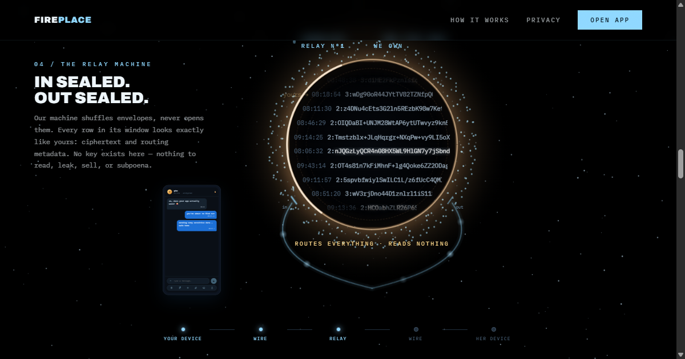

<p align="center">
  <a href="https://fireplace.ignorelist.com/welcome/">
    
  </a>
</p>

<h1 align="center">Fireplace</h1>

<p align="center">
  <strong>Messages only two people can read.</strong><br>
  End-to-end encrypted chat. Every message is sealed on your device with the
  Signal protocol before it touches the network — the server relays ciphertext
  and understands none of it.
</p>

<p align="center">
  <a href="https://fireplace.ignorelist.com/welcome/"><strong>Visit the landing page</strong></a>
  ·
  <a href="https://fireplace.ignorelist.com/"><strong>Open the app</strong></a>
</p>

---

## What this repo is

The source of Fireplace's landing page — the site's business card, served at
[`fireplace.ignorelist.com/welcome/`](https://fireplace.ignorelist.com/welcome/).

It's a single static page, built by hand:

- **Astro** (static output) + **Lenis** smooth scroll — no page framework, no GSAP.
- **Hand-rolled canvas modules**: a draggable dot-globe, a live "what our server
  sees" encryption demo, and an 800vh scroll-driven *journey of a message* —
  a custom scroll-progress engine that walks one message from a sender's phone,
  through the relay, to the recipient, seal intact the whole way.
- Interactive on purpose: type in the hero terminal and watch your words turn
  into the real `3:` PreKey envelope shape; write in the phone composer and send
  the message yourself.

The Fireplace app itself (Flutter PWA + NestJS backend) lives in the main
[`Lentach/Fireplace`](https://github.com/Lentach/Fireplace) repository.

## Content honesty rules (do not regress)

The page makes no claim the product can't back:

- No fake trust signals — no download counts, no testimonials.
- "Public source", **not** "open source" — there is no LICENSE file yet; upgrade
  the wording only after adding one.
- The relay machine transforms nothing: same ciphertext in, same ciphertext out.

## Repository layout

| Path | What it is |
| --- | --- |
| `src/pages/index.astro` | The whole page: nav, globe hero, journey, features, ledger, outro |
| `src/scripts/globe.ts` | Hero dot-globe (drag to rotate, Ctrl+scroll to zoom) |
| `src/scripts/journey.ts` | The spine: scroll-driven journey of a message; interactive send |
| `src/scripts/encrypt.ts` | "What our server sees" hero terminal demo |
| `src/scripts/util.ts` | Shared math/canvas helpers |
| `src/styles/landing.css` | All styling |
| `brand/` | Logo sources (SVG + rendered PNGs) |

## Local dev

```bash
npm install
npm run dev        # http://localhost:4321/welcome
npm run build && npm run preview
```

## Deploy

```powershell
.\deploy-landing.ps1
```

Builds, uploads to a staging dir on the VM, atomic-swaps into the nginx-served
directory, and verifies the live URL + asset hashes. One-time nginx setup and
operational details: [`CLAUDE.md`](CLAUDE.md).

<details>
<summary>nginx block (one-time server setup)</summary>

Add to the host config, alongside the existing blocks (landing assets live
under `/welcome/assets/`):

```nginx
location = /welcome { return 301 /welcome/; }
location ^~ /welcome/ {
    alias /home/ubuntu/fireplace/landing-build/;
    index index.html;
}
```

No `try_files` on purpose — `alias` + `try_files` is an nginx footgun and a
single static page needs no SPA fallback. Then `sudo nginx -t && sudo
systemctl reload nginx`. Subsequent deploys are file-only, no reload needed.

</details>

---

<p align="center">
  Built by one guy. Sealed on your device. <a href="https://fireplace.ignorelist.com/welcome/">See for yourself.</a>
</p>
